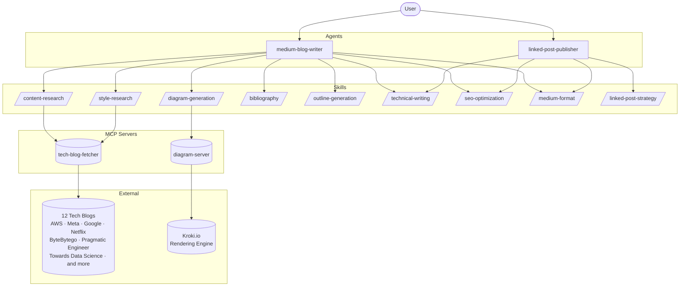

# Tech Blog Writer

An AI-powered writing system for creating, researching, and publishing technical blog posts on Medium. Built around two agents, nine specialized skills, and two MCP servers that give the system live web access and diagram generation.

---

## Architecture



---

## How It Works

The system is built on three layers that work together:

**Agents** own the goal. They plan the workflow, decide which skills to call and in what order, and hold context across the full session. You talk to an agent; the agent coordinates everything else.

**Skills** handle individual jobs. Each skill does exactly one thing well: research, outline, diagram, cite, optimize, format. They are stateless and reusable across agents.

**MCP Servers** give skills live capabilities they could not have otherwise. The `tech-blog-fetcher` server fetches and parses real content from 12 major engineering blogs. The `diagram-server` generates architecture diagrams, flowcharts, and sequence diagrams via Kroki.io and returns image URLs that embed directly in Medium articles.

---

## Agents

### medium-blog-writer

Writes original technical articles for Medium from scratch. Orchestrates the full pipeline from research through publication.

**Full workflow:**

1. `/style-research` — fetches how top writers currently cover the topic, produces a Style Brief
2. `/content-research` — gathers sources, facts, and data points; outputs a Source Registry
3. `/outline-generation` — structures the article, flags sections that need diagrams
4. `/diagram-generation` — creates and renders diagrams before prose is written
5. `/technical-writing` — drafts with accuracy, clarity, and correct code examples
6. `/bibliography` — formats the Source Registry into inline citations and a bibliography section
7. `/seo-optimization` — optimizes title, subtitle, and tags for Medium's algorithm
8. `/medium-format` — applies final Medium-specific formatting

**Invoke:**
```
Using the medium-blog-writer agent, write an article about [topic]
```

---

### linked-post-publisher

Adapts existing blog content into Medium Linked Posts: original summaries that drive traffic back to the source article.

**Workflow:** Analyze source content → Adapt for Medium audience → Optimize metadata → Add CTAs → Format → Publish

**Invoke:**
```
Using the linked-post-publisher agent, create a Linked Post for [article URL or content]
```

---

## Skills

### /content-research
Searches for credible sources using the `tech-blog-fetcher` MCP server across 12 engineering blogs plus official docs and academic papers. Outputs a structured **Source Registry** (title, URL, author, publication date, credibility) and an **Inline Citation Map** that ties every factual claim to a source. This feeds directly into `/bibliography`.

### /style-research
Fetches 2-3 recent articles on the topic from top writers, analyzes their tone, vocabulary, structure, analogy usage, and heading style, then produces a **Style Brief**. The agent uses this brief before drafting so writing decisions are grounded in how the best writers handle this exact topic today, not generic advice.

### /diagram-generation
Writes Mermaid diagram source code (flowcharts, sequence diagrams, architecture diagrams, mind maps), validates it against Kroki.io, and returns a markdown image tag ready to paste into Medium. Diagrams are generated before the prose is written so the text can reference them naturally.

### /bibliography
Takes the Source Registry from `/content-research` and produces two things: inline citation markers (`[1]`, `[2]`) to embed in the article body, and a formatted bibliography section grouped by source type (Research Papers, Engineering Blogs, Official Documentation). Also runs a missing citation audit before the article is finalized.

### /outline-generation
Structures the article into sections with logical progression, identifies which sections need diagrams, estimates depth per section, and selects the right content pattern (Problem → Solution → Implementation, Theory → Practice → Application, etc.).

### /technical-writing
Ensures code examples are complete, runnable, and commented. Verifies technical claims against sources. Structures explanations from simple to complex. Applies the three-layer approach: name the concept, show it visually, walk through a concrete example.

### /seo-optimization
Optimizes title, subtitle, and tags for Medium's recommendation algorithm. Targets a mix of broad tags (500K+ followers), specific tags (2-3), and one trending tag. Ensures the title is benefit-focused and keyword-included.

### /medium-format
Applies Medium-specific markdown formatting: heading hierarchy, code block syntax highlighting, image placement, emphasis and callouts, and a final publication checklist.

### /linked-post-strategy
Guides the Linked Post workflow: content selection criteria, three adaptation strategies (full cross-post, curated summary, expansion), CTA templates, linking best practices, and timing guidance.

---

## MCP Servers

### tech-blog-fetcher

Provides live web access to 12 engineering blog sources.

| Source | Category |
|--------|----------|
| The Pragmatic Engineer | Independent |
| ByteByteGo | Independent |
| Towards Data Science | Community |
| freeCodeCamp | Community |
| Hackernoon | Community |
| AWS Blog | Big Tech |
| Amazon Science | Big Tech |
| Meta Engineering | Big Tech |
| Google AI Blog | Big Tech |
| Google Developers Blog | Big Tech |
| DeepMind Blog | Big Tech |
| Netflix Tech Blog | Big Tech |

**Tools:** `fetch_recent_posts`, `fetch_article_content`, `search_sources`, `list_sources`

### diagram-server

Generates diagrams from source code and returns Kroki.io image URLs that embed directly in Medium articles.

**Supported types:** Mermaid, PlantUML, Graphviz, Blockdiag, Seqdiag, Excalidraw

**Tools:** `render_diagram`, `validate_and_render`, `list_diagram_types`

---

## Project Structure

```
tech_blog_writer/
├── README.md
├── .claude/
│   └── settings.json              # MCP server configuration
├── .github/
│   ├── agents/
│   │   ├── medium-blog-writer.agent.md
│   │   └── linked-post-publisher.agent.md
│   └── skills/
│       ├── content-research/SKILL.md
│       ├── style-research/SKILL.md
│       ├── diagram-generation/SKILL.md
│       ├── bibliography/SKILL.md
│       ├── outline-generation/SKILL.md
│       ├── technical-writing/SKILL.md
│       ├── seo-optimization/SKILL.md
│       ├── medium-format/SKILL.md
│       └── linked-post-strategy/SKILL.md
└── mcp/
    ├── tech-blog-fetcher/         # Fetches content from engineering blogs
    │   ├── src/
    │   │   ├── index.ts
    │   │   ├── sources.ts
    │   │   └── fetcher.ts
    │   ├── package.json
    │   └── tsconfig.json
    └── diagram-server/            # Renders diagrams via Kroki.io
        ├── src/
        │   ├── index.ts
        │   ├── renderer.ts
        │   └── examples.ts
        ├── package.json
        └── tsconfig.json
```

---

## Quick Start

### Requirements

- VS Code with GitHub Copilot Chat
- Node.js 18+ (for MCP servers)

### Setup MCP Servers

```bash
# tech-blog-fetcher
cd mcp/tech-blog-fetcher
npm install && npm run build

# diagram-server
cd mcp/diagram-server
npm install && npm run build
```

The `.claude/settings.json` file registers both servers automatically when you open this project in Claude Code.

### Write Your First Article

```
Using the medium-blog-writer agent, write an article about [topic]
```

### Use Skills Directly

```
/style-research      — analyze how top writers cover [topic]
/content-research    — research [topic] and build a source list
/diagram-generation  — create an architecture diagram showing [concept]
/bibliography        — format my sources into a bibliography
/outline-generation  — create an outline for an article about [topic]
/seo-optimization    — optimize this title: "[your title]"
/medium-format       — format my article for Medium
```

---

## Writing Workflow

The `medium-blog-writer` agent follows this sequence for every article:

```
Style Research → Content Research → Outline → Diagrams → Draft → Bibliography → SEO → Format → Publish
```

Each step feeds the next. The Style Brief shapes how the draft is written. The Source Registry feeds the bibliography. Diagrams are embedded before prose is written so the text references them naturally. Nothing is skipped.
