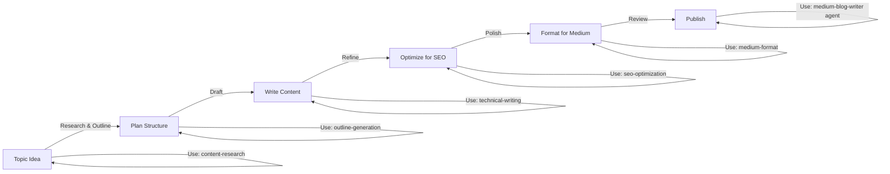
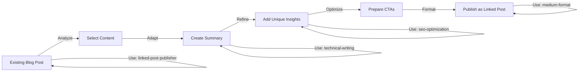

# Tech Blog Writer

An AI-powered system for creating, optimizing, and publishing high-quality technical blog posts on Medium. Includes specialized agents and skills for the complete writing workflow.

## 🎯 What Is This?

A comprehensive agent system built with VS Code that helps you:
- Write original technical articles for Medium
- Repurpose existing blog content as Linked Posts
- Research topics and validate sources
- Optimize content for Medium's algorithm
- Format articles with Medium best practices
- Build a cross-platform presence

## 🚀 Quick Start

### For Writing Original Articles
```
Using the medium-blog-writer agent, help me write a blog post about [topic]
```

### For Creating Linked Posts (Summaries with Links)
```
Using the linked-post-publisher agent, create a Linked Post for my blog article about [topic]
```

### For Specific Guidance
```
/outline-generation - Create a blog post outline
/seo-optimization - Optimize my article title and tags
/technical-writing - Review code examples for accuracy
/medium-format - Format my article for Medium
/content-research - Research a technical topic
/linked-post-strategy - Learn about Linked Post publishing
```

## 📦 System Components

### Agents (2)

#### 1. **medium-blog-writer**
Specialized agent for writing original technical blog posts for Medium.

**Capabilities:**
- Topic ideation and research
- Outline creation and planning
- Technical content drafting
- SEO optimization
- Content formatting for Medium
- Editing and refinement
- Publishing guidance

**Use when:** Creating original, in-depth technical articles from scratch

**Workflow:** Research → Outline → Draft → Optimize → Format → Publish

---

#### 2. **linked-post-publisher**
Specialized agent for creating Linked Posts—curated summaries that link to your original blog content.

**Capabilities:**
- Analyze existing blog content for Medium adaptation
- Create unique Medium summaries (30-50% of original)
- Generate compelling calls-to-action
- Optimize metadata for Medium algorithm
- Structure for cross-platform publishing
- Guide complete Linked Post workflow

**Use when:** You want to repurpose existing blog posts on Medium while driving traffic back to your original content

**Workflow:** Select Content → Create Summary → Optimize → Format → Publish

---

### Skills (6)

#### 1. **Content Research** (`/content-research`)
Find and validate technical sources for your articles.

**What it does:**
- Identifies credible, authoritative sources
- Gathers technical references and documentation
- Validates claims and facts
- Organizes information by topic
- Suggests data points and examples

**Use when:** You need to research a technical topic, find sources, or verify accuracy

---

#### 2. **SEO Optimization** (`/seo-optimization`)
Optimize content for Medium's algorithm and search discoverability.

**What it does:**
- Creates keyword-optimized titles
- Suggests relevant tags (3-5)
- Writes compelling subtitles
- Optimizes content structure for readability
- Improves signals for Medium's recommendation algorithm

**Use when:** You want to improve discoverability or optimize headlines and tags

**Key Focus Areas:**
- Title optimization (benefit-focused, keyword-included)
- Tag selection (1 broad, 2-3 specific, 1 trend)
- Subtitle creation
- Content structure optimization

---

#### 3. **Technical Writing** (`/technical-writing`)
Ensure technical accuracy, clarity, and professional quality.

**What it does:**
- Verifies code example correctness
- Clarifies complex technical concepts
- Structures technical arguments logically
- Reviews documentation quality
- Adapts content for developer audience

**Use when:** You need to ensure technical accuracy, improve clarity, or review code examples

**Quality Checklist:**
- Accuracy (tested code, verified facts)
- Clarity (concepts explained simply first)
- Completeness (edge cases, error handling)
- Professionalism (consistent terminology, proper formatting)

---

#### 4. **Medium Format** (`/medium-format`)
Apply Medium-specific markdown and formatting best practices.

**What it does:**
- Formats markdown for Medium platform
- Structures content with proper heading hierarchy
- Formats code blocks with syntax highlighting
- Optimizes visual hierarchy and emphasis
- Prepares articles for publication

**Use when:** You need to format content for Medium or prepare for publishing

**Covers:**
- Markdown syntax for Medium
- Code block formatting
- Image and media integration
- Readability optimization
- Publication preparation checklist

---

#### 5. **Outline Generation** (`/outline-generation`)
Create comprehensive blog post outlines and structure.

**What it does:**
- Breaks down complex topics into manageable sections
- Creates logical information progression
- Plans code examples and visuals
- Estimates section depth and length
- Suggests content patterns (Problem→Solution, Theory→Practice, etc.)

**Use when:** Planning article structure or organizing ideas

**Patterns Included:**
- Problem → Solution → Implementation
- Concept → Variations → Advanced
- Theory → Practice → Application
- Quick Start → Deep Dive → Mastery

---

#### 6. **Linked Post Strategy** (`/linked-post-strategy`)
Learn and execute cross-platform content publishing strategy.

**What it does:**
- Explains Linked Post fundamentals and benefits
- Provides 3 strategy options (full cross-post, curated summary, expansion)
- Offers ready-to-use templates
- Guides linking and CTA best practices
- Covers timing, frequency, and measurement

**Use when:** Creating Linked Posts or planning cross-platform content strategy

**Key Concepts:**
- What Linked Posts are and how they work
- Different strategy approaches
- Content adaptation techniques
- Traffic optimization
- SEO considerations

---

## 📁 Project Structure

```
tech_blog_writer/
├── README.md                          # This file
├── requirements.txt                   # Python dependencies
├── .github/
│   ├── agents/
│   │   ├── medium-blog-writer.agent.md
│   │   └── linked-post-publisher.agent.md
│   └── skills/
│       ├── content-research/
│       │   └── SKILL.md
│       ├── seo-optimization/
│       │   └── SKILL.md
│       ├── technical-writing/
│       │   └── SKILL.md
│       ├── medium-format/
│       │   └── SKILL.md
│       ├── outline-generation/
│       │   └── SKILL.md
│       └── linked-post-strategy/
│           └── SKILL.md
```

## 💡 Usage Workflows

### Workflow 1: Original Article from Scratch



**Step-by-step:**
1. Use `medium-blog-writer` agent to start
2. Use `/content-research` to gather sources and validate info
3. Use `/outline-generation` to structure your article
4. Draft with `/technical-writing` guidance for accuracy
5. Use `/seo-optimization` for titles, tags, and keywords
6. Use `/medium-format` for final formatting
7. Publish on Medium

### Workflow 2: Repurpose Blog to Linked Post



**Step-by-step:**
1. Identify blog post (1,000+ words, 1-2 weeks old)
2. Use `linked-post-publisher` agent to create summary
3. Adapt content for Medium audience (800-1,500 words)
4. Use `/technical-writing` to ensure accuracy
5. Use `/seo-optimization` for unique Medium title and tags
6. Use `/medium-format` for formatting and CTAs
7. Publish as Linked Post on Medium

## 🎯 Best Practices

### Content Strategy
- **Quality over Quantity**: One great article beats five mediocre ones
- **Original Value**: Always provide value to Medium readers
- **Consistent Schedule**: Publish on a regular schedule (1-2x/week recommended)
- **Build Authority**: Focus on your expertise area

### Medium Optimization
- **Strong Titles**: Lead with benefit or intrigue, include keyword
- **Good Tags**: 1 broad (500K+ followers), 2-3 specific, 1 trending
- **Visual Breaks**: Use headers, lists, code blocks for scannability
- **Code Examples**: Complete, commented, tested code
- **Engagement**: Respond to comments, build community

### Linked Post Strategy
- **Wait 1-2 Weeks**: Publish original first, then Linked Post
- **Unique Content**: Adapt for Medium, don't just copy/paste
- **Strong CTAs**: Clear call-to-action driving back to original
- **Strategic Links**: 1-2 links maximum, descriptive anchor text
- **Measure Results**: Track traffic from Medium to your blog

## 📊 Expected Results

With consistent publishing (1-2x/week):

- **Month 1**: 500-1K Medium followers, establish voice
- **Month 2-3**: 2K+ followers, measurable traffic to blog
- **Month 6+**: 5K+ followers, established authority

With Linked Posts: 20-30% of Medium readers click back to original

## 🔍 How Agents Work

Agents are AI-powered assistants available as chat commands:
- Type `/medium-blog-writer` in Chat to invoke the agent
- Type `/linked-post-publisher` for Linked Post workflow
- Type `/skill-name` to invoke a specific skill (e.g., `/seo-optimization`)

Skills provide specialized guidance on specific tasks.

## 📝 Requirements

- VS Code with Copilot extension
- GitHub Copilot Chat access
- Text editor for writing content

## 🚀 Getting Started

1. **Create Your First Article**
   ```
   Using the medium-blog-writer agent, help me create a blog post about [topic]
   ```

2. **Optimize Your Title**
   ```
   /seo-optimization - Optimize this title for Medium: "[Your Title]"
   ```

3. **Format for Medium**
   ```
   /medium-format - Format my article and prepare for publication
   ```

4. **Publish Your Content**
   Follow Medium's publishing flow with your formatted content

5. **Create Linked Posts**
   Once you have blog content, use `linked-post-publisher` to amplify reach

## 💬 Tips & Tricks

- **Use Agents First**: Start conversations with agent names for guided workflows
- **Combine Skills**: Use multiple skills in one session for best results
- **Iterate**: Use feedback to improve titles, structure, and content
- **Track Metrics**: Monitor views, claps, traffic to measure success
- **Engage Community**: Respond to comments to boost algorithm signal

## 🤝 Contributing

Feel free to extend agents and skills:
- Add new skills for specialized tasks
- Create custom agents for specific workflows
- Share templates and best practices

## 📚 Additional Resources

- [Medium Creator Program](https://medium.com/creators)
- [Medium Story Format Guide](https://help.medium.com/hc/en-us/articles/225168768)
- [Technical Writing Guide](./github/skills/technical-writing/SKILL.md)
- [SEO Best Practices](./github/skills/seo-optimization/SKILL.md)

---

**Created with AI agents and VS Code** 🤖
